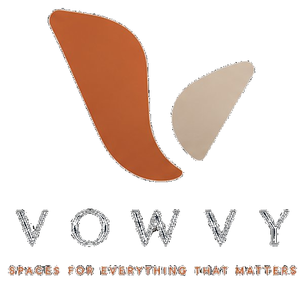

# Vowvy Website

**Live URL:** https://www.vowvy.com

---

## File Structure

```
vowvy/
├── index.html              ← Main landing page
├── CNAME                   ← Custom domain for GitHub Pages
├── css/
│   └── style.css           ← All styles (brand tokens, layout, responsive)
├── js/
│   └── main.js             ← Nav scroll, animations, phone mockup, waitlist form
└── assets/
    └── images/
        ├── logo-main.png       ← PLACEHOLDER — add your main logo
        ├── logo-check.png      ← PLACEHOLDER — add your checkmark logo
        ├── favicon-32.png      ← PLACEHOLDER — add 32×32 favicon
        ├── favicon-16.png      ← PLACEHOLDER — add 16×16 favicon
        ├── apple-touch-icon.png ← PLACEHOLDER — add 180×180 icon
        └── og-image.png        ← PLACEHOLDER — add 1200×630 social share image
```

---

## Deploying to GitHub Pages

### First time setup

1. Create a new GitHub repository named `vowvy-website` (or any name you like)
2. Upload all these files to the repo
3. Go to **Settings → Pages**
4. Under **Source**, select `main` branch, `/ (root)` folder
5. Click **Save**

### Connecting your custom domain

1. In **Settings → Pages → Custom domain**, enter `www.vowvy.com`
2. At your domain registrar (where you bought vowvy.com), add these DNS records:

```
Type    Name    Value
A       @       185.199.108.153
A       @       185.199.109.153
A       @       185.199.110.153
A       @       185.199.111.153
CNAME   www     YOUR-USERNAME.github.io
```

3. Check **Enforce HTTPS** once DNS propagates (can take up to 48 hours)

---

## Switching to vowvy.ai

If you purchase vowvy.ai, only two things need to change:

1. **`CNAME`** — change `www.vowvy.com` to `www.vowvy.ai`
2. **`index.html`** — update the three lines near the top:
   - `<link rel="canonical" href="https://www.vowvy.ai/" />`
   - `<meta property="og:url" content="https://www.vowvy.ai/" />`
   - og:image URL

Then update your DNS records at your new registrar to point to GitHub Pages.

---

## Adding your logos

When your artwork is ready, drop these files into `assets/images/`:

| File | Size | Used for |
|------|------|---------|
| `logo-main.png` | ~320×80px | Nav + footer |
| `logo-check.png` | ~120×120px | Waitlist section |
| `favicon-32.png` | 32×32px | Browser tab |
| `favicon-16.png` | 16×16px | Browser tab (small) |
| `apple-touch-icon.png` | 180×180px | iPhone home screen |
| `og-image.png` | 1200×630px | Social media previews |

Then in `index.html`, find the logo placeholder comments and replace them:

```html
<!-- Replace this: -->
<span class="logo-wordmark">VOWVY</span>

<!-- With this: -->

```

---

## Connecting a waitlist service

In `js/main.js`, find the `TODO` comment in the waitlist section and replace with your form endpoint.

**Recommended free options:**
- [Formspree](https://formspree.io) — easiest, no account setup needed for basic use
- [Mailchimp](https://mailchimp.com) — best for email marketing later
- [ConvertKit](https://convertkit.com) — great for creator/startup audiences

---

## Brand Colors (for reference)

| Token | Hex | Use |
|-------|-----|-----|
| Terracotta | `#C96A3D` | CTAs, accents, active states |
| Warm Sand | `#D9C7B6` | Secondary accent |
| Soft Ivory | `#F7F3EE` | Primary background |
| Warm Beige | `#EFE7DE` | Secondary background |
| Charcoal Slate | `#1F2730` | Primary text |
| Muted Slate | `#5B6570` | Secondary text |
| Deep Slate | `#101A23` | Dark sections |
| Dark Graphite | `#182028` | Dark surfaces |
